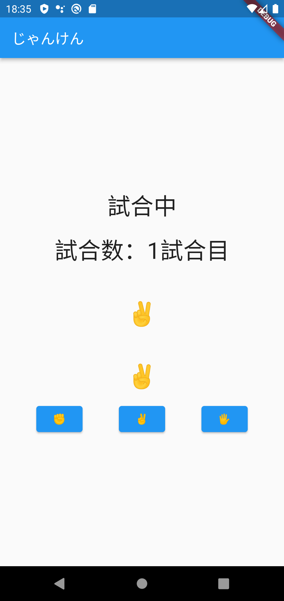
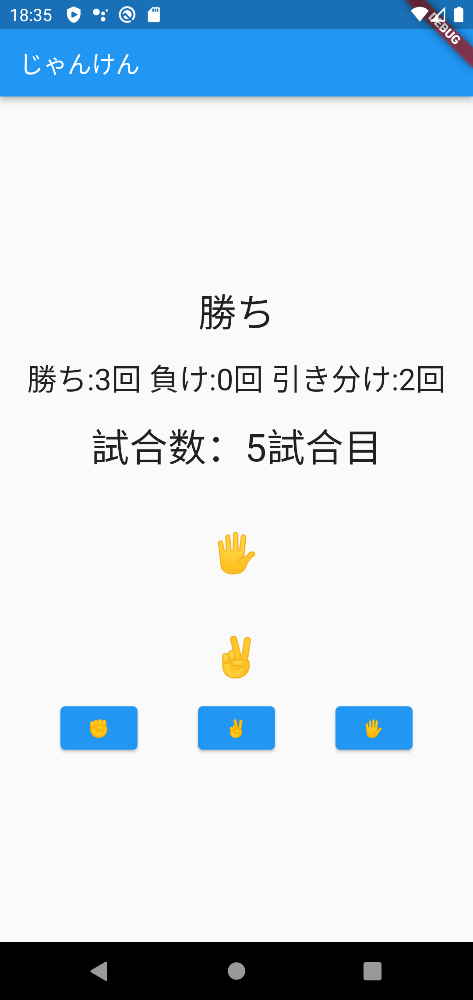

# flutter_jankenapp

## Flutterの教科書 実践課題

### 第７章 変数・関数・条件分岐の基礎『じゃんけん』

このじゃんけんを 5 回勝負にして、5 回目のじゃんけんが終わるタイミングでプレイヤーが 5 回中何回勝ったかを表示してみましょう。

- 現在何回目の勝負なのかを記録する
- 5回分の勝敗を記録する
- 勝った回数を記録する
- 5回目が終わったら結果を表示する
- 表示が終わったらリセットして 1 回目に戻る

上記の課題の完成図
試合中（５試合未満）

試合結果（５試合終わった時の表示）

